 

<pre>
beGG1@github
-------------------------
Name: Stepan Shabalinov
Uptime: From 2001
Class: Nerd
BSc: Informatics && Computer Science
MSc: Software Engeneer

OS: BTW I use Arch
Battery: 75%% [Discharging]
Purpose: 42
</pre>
   

   &nbsp; &nbsp; &nbsp; &nbsp; &nbsp;
   
   

<h2>📈 GitHub Activity Graph:</h2>

<table>
    <tr>
        <td align="center">
<!-- todo: integrate dynamic light/dark mode
        

        </td>
        <td rowspan="2" align="center">
-->
    
        </td>
    </tr>
    <tr>
        <td align="center"></td>
    </tr>
    <tr>
        <td colspan="2" align="center"></td>
    </tr>
</table>
